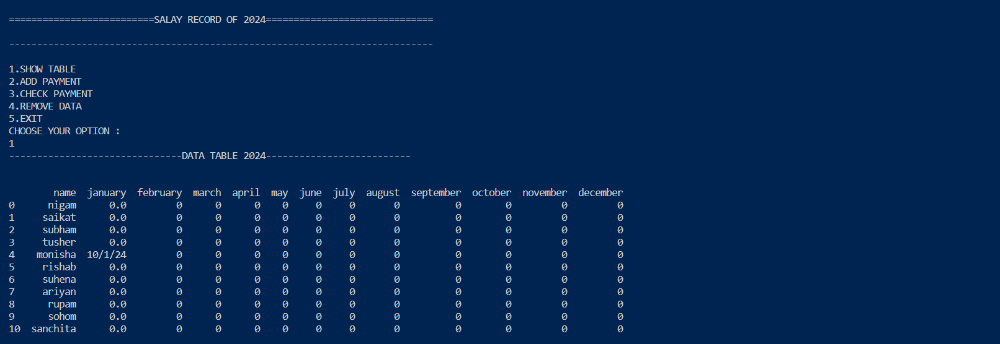

# STUDENT-SALARY-MANAGEMENT-SYSTEM


## Introduction
This is a simple salary management system for the year 2024. It allows users to log in, view a salary record, and perform operations like adding, checking, and removing payment details for students.

## Files and Usage

### `main.py`
This script handles the main functionality of the salary management system. It prompts the user to enter a username and password for login. Upon successful login, it provides options to show the salary table, add payments, check payments, remove data, or exit.

### `password.py`
This module contains functions related to user authentication. It reads user credentials from a JSON file and provides a login function to verify the entered username and password.

### `system.py`
This module defines functions for interacting with the salary data stored in a CSV file. It includes functions to show the salary table, add payments, check payments, and remove data.

### `trysalary2024.csv`
This CSV file contains sample data for the salary management system.

## Usage
1. Run `main.py` to start the salary management system.
2. Enter your username and password when prompted for login.
3. Choose from the available options to interact with the salary data.

## Dependencies
- `numpy`: Library for numerical operations in Python.
- `pandas`: Data manipulation library for Python.


## Ingredients


## outputs
# Login


# Check table




## Installation
Install the required dependencies using the following command:
```bash
pip install numpy pandas

